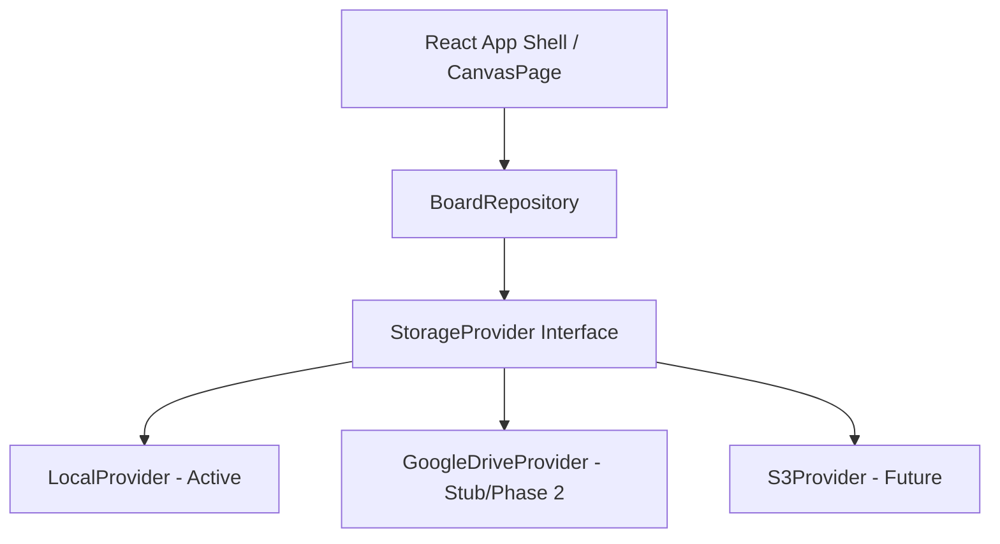
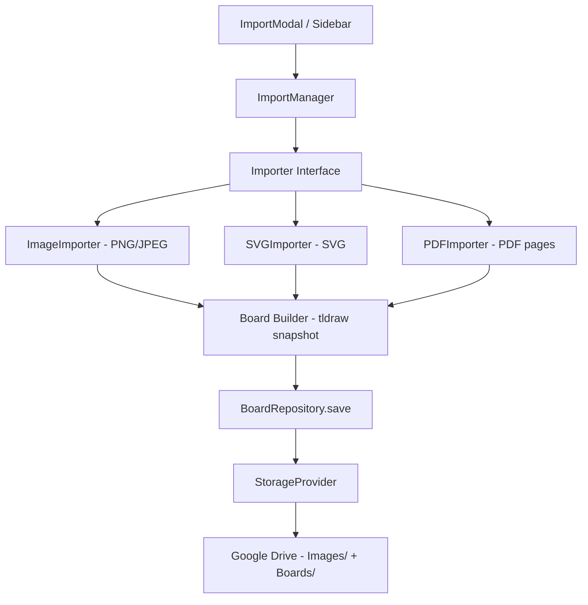

# Architecture - Infinite Whiteboard

This document describes the high-level architecture, design decisions, and core principles of the personal, self-hosted infinite whiteboard application.

---

## Design Principles

### 1. Modularity
All components and modules must be decoupled. The UI should not depend directly on how data is saved or retrieved, and the whiteboard engine itself should be completely pluggable.

### 2. Storage Abstraction
We define a clear separation between the board storage layer and the rest of the application. 
- **`StorageProvider`**: A low-level file/asset storage interface that handles reading, writing, and listing files. 
- **`BoardRepository`**: A high-level domain repository that interacts with the `StorageProvider` to load, save, delete, rename, and duplicate boards.
The frontend controls are bound to the `BoardRepository` interface, ensuring that moving from `LocalProvider` (LocalStorage-based) to `GoogleDriveProvider` (Google Drive API-based) or `SupabaseProvider` requires zero UI or routing modifications.



### 3. Untouched Canvas Engine
tldraw is treated as an external black-box rendering engine. The application renders the tldraw viewport inside our `CanvasPage` and syncs tldraw's snapshot changes to our `BoardRepository`. We do not customize tldraw's internals, allowing easy upgrades to newer tldraw versions.

### 4. Board Data Model (JSON)
All boards are serialized and saved as pure JSON.
```typescript
interface Board {
  id: string;          // UUID
  title: string;       // Human-readable title
  createdAt: string;   // ISO Date
  updatedAt: string;   // ISO Date
  thumbnail?: string;  // Base64 or URL thumbnail
  elements: any[];     // Array of shapes/drawings representing canvas state
  metadata?: Record<string, any>; // Extensible metadata (tags, preferences)
}
```

### 5. Non-Duplicated Image Assets
Images are stored once in the storage provider (e.g., a specific folder in Google Drive). The board elements only store a reference to the file ID (`driveFileId`) and basic transformation metadata (position, scale, rotation).

---

## Application Layers

1. **Presentation Layer (React Components)**
   - Foldable board list sidebar.
   - Clean top toolbar with editable title, status indicator, routing buttons, and theme toggler.
   - Pages: `/` (redirects to active/last board), `/boards` (dashboard), `/settings` (theme & storage settings), `/about`.

2. **Domain/Repository Layer (`BoardRepository`)**
   - Coordinates metadata management and file serialization.
   - Saves active board changes using debounced auto-save.

3. **Storage Provider Layer (`StorageProvider`)**
   - Stubbed/implemented as:
     - `LocalProvider`: Saves serialized boards to standard browser LocalStorage.
     - `GoogleDriveProvider`: Integrates with Google Drive v3 REST API (Phase 2).

---

## Phase 4: Whiteboard Migration Engine

### Overview

A modular import pipeline that converts external content (PNG, JPEG, SVG, PDF) into Mosaic boards. The pipeline is fully extensible — new formats can be added by implementing the `Importer` interface without modifying any existing code.



### Key Design Decisions

1. **Importer interface** (`src/services/import/Importer.ts`): Each importer only knows how to read its source format and produce a normalized tldraw snapshot. It has no knowledge of the UI or board metadata.

2. **Asset isolation**: All image assets are uploaded to `Images/` inside the Mosaic workspace. Board JSON stores only `asset-id://<assetId>` references — never binary data.

3. **Runtime asset resolution**: `CanvasPage.tsx` resolves `asset-id://` references at board load time by downloading blobs and generating temporary browser Object URLs. The auto-save listener reverses this before persistence.

4. **Locked by default**: All imported shapes have `isLocked: true`. Users can unlock them individually if they want to reposition the imported content.

5. **Import history**: Every import attempt is logged to `localStorage` (`whiteboard_import_logs`) and displayed in Settings → Whiteboard Migration Logs.

### Adding a New Importer

Create `src/services/import/importers/YourImporter.ts` implementing `Importer`, then register it in `ImportManager.ts`. No UI changes needed.

See [`ImportPipeline.md`](./ImportPipeline.md) and [`BoardFormat.md`](./BoardFormat.md) for full details.
